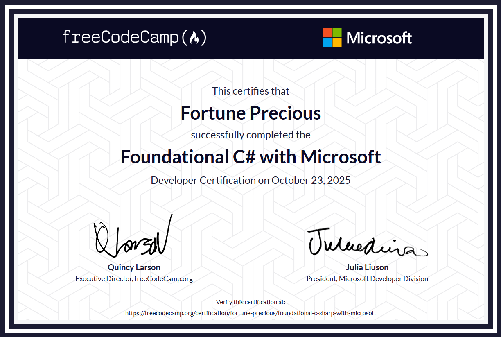

# Foundational-C#

## Create New Console Project

-  dotnet new console -o MyConsoleApp

## Run a C# program

-  dotnet run

## Build a C# program
-  dotnet build

## My certificate:

## Exam Score:

